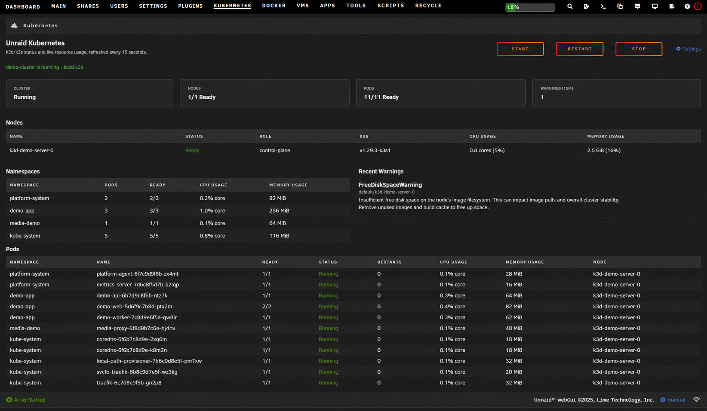
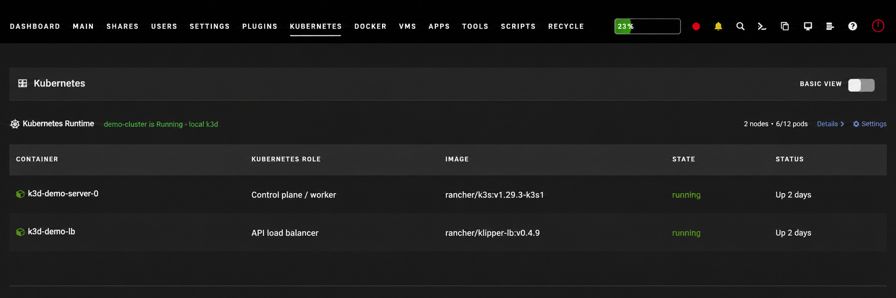
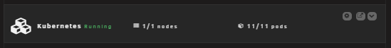

# Unraid Kubernetes

Native Unraid plugin for installing, adopting, managing, and observing a
k3d/K3S cluster without running a separate web server.

It integrates cluster operations directly into Unraid while keeping
application deployment separate. Use the built-in interface for host-level
cluster lifecycle and visibility, then deploy workloads with Kubernetes
manifests, Helm, or your preferred GitOps tooling.

## Preview

### Cluster Overview

The dedicated Kubernetes page summarizes cluster health, nodes, namespaces,
pods, warnings, and guarded lifecycle actions.



### Docker Integration

k3d runtime containers are grouped above the standard Docker container list so
their Kubernetes roles and state remain visible without presenting them as
editable Unraid templates.



### Dashboard Widget

The compact dashboard tile provides at-a-glance cluster, node, and pod health
with quick links to details and lifecycle controls.



## How It Installs

This is an **Unraid plugin**, not a Docker template. Install the `.plg` from
**Plugins**, or from a Community Apps entry published as a plugin. Installation
does four things:

```text
https://raw.githubusercontent.com/DonnieDice/unraid-kubernetes/main/plugin/unraid.kubernetes.plg
```

1. Downloads and verifies a pinned k3d binary.
2. Installs the Kubernetes page, dashboard tile, Docker-page summary, and
   lifecycle service into Unraid's native webGUI.
3. Creates or adopts persistent cluster configuration under appdata.
4. Starts k3d, which creates a K3S server container and load-balancer container
   in Unraid's Docker daemon.

After installation:

- **Plugins** shows the installed plugin and updates.
- **Kubernetes** shows cluster health, workloads, lifecycle, and settings.
- **Dashboard** offers a movable Kubernetes health tile.
- **Docker** shows the Kubernetes runtime above the regular container list.
- **Settings** includes a Kubernetes button for configuration and project help.

The generated k3d containers are moved into the Kubernetes runtime section and
hidden from the regular Docker container table. They are not normal Unraid
template containers. Do not recreate them through Docker **Edit**. k3d owns
their labels, mounts, command line, and network. Change cluster settings through
the Kubernetes settings page and deploy applications through Kubernetes
manifests, Helm charts, or your preferred GitOps tooling.

Removing the plugin stops the cluster but preserves its datastore, token,
kubeconfig, and local-path storage for deliberate recovery or deletion.

## Interfaces

- Dedicated **Kubernetes** page with cluster, node, pod, namespace, and warning
  status.
- Movable Kubernetes dashboard tile using Unraid's native `$mytiles` API.
- Compact Kubernetes summary and k3d runtime-container list at the top of the
  Docker page.
- Guarded start, stop, and restart controls through Unraid's CSRF-protected
  PHP webGUI.
- Native editable plugin settings without exposing Kubernetes credentials.

The plugin renders through Unraid's existing nginx/PHP webGUI. It does not
install nginx, Apache, or another UI container.

## Responsibilities

The plugin owns the Unraid host substrate:

- A pinned k3d binary.
- Persistent host settings.
- Cluster startup and shutdown integration.
- Safe creation of a new single-server cluster.
- Adoption of an existing cluster without rewriting its configuration or
  datastore.
- Read-only Kubernetes status collection.

The status backend supports two provider modes:

- `k3d`: installs and manages a local cluster in Unraid Docker.
- `external`: monitors a direct or VM-hosted K3S cluster through a protected
  kubeconfig and host `kubectl`; lifecycle controls are intentionally disabled.

This lets the same Unraid UI remain in place if a local experimental cluster
later moves to a multi-machine K3S control plane.

Application manifests and GitOps remain in separate infrastructure or
application repositories. Installing this plugin does not deploy application
workloads.

## Persistent Paths

Plugin settings are stored at:

```text
/boot/config/plugins/unraid.kubernetes/settings.cfg
```

New installations default to:

```text
/mnt/user/appdata/unraid-kubernetes
```

Existing configuration and data files are never overwritten.

## Project

- [Source and releases](https://github.com/DonnieDice/unraid-kubernetes)
- [Help and support](https://github.com/DonnieDice/unraid-kubernetes/discussions)

GitHub Discussions is the project's support forum. Community Applications may
still report that an Unraid forum support thread is absent because its template
validator only recognizes `forums.unraid.net` threads.

GitLab is the development and CI/CD source of truth. Successful changes flow to
GitHub as the downstream public mirror used for distribution and releases.

## Development

Run validation and build the Slackware package:

```bash
./tools/test.sh
./tools/build.sh
```

Artifacts are written to `dist/`. A release pipeline renders the `.plg`
manifest after the package checksum is known.

When changing `VERSION`, also update `RELEASE_EPOCH` to the release timestamp.
Unraid uses packaged file modification times to invalidate browser assets.

## Security

- Kubernetes credentials never pass through the browser.
- The status endpoint invokes only fixed Docker and kubectl commands.
- Lifecycle actions are allowlisted and protected by Unraid's global CSRF
  middleware.
- Runtime settings are validated before use by root-privileged scripts.
